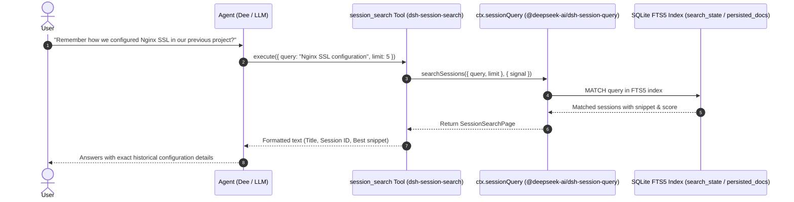

# 🔍 @goodandready/dsh-session-search

<div align="center">

<h3>Model-Facing Session Full-Text Search Tool for DeepSeek Harness Agents</h3>

<p align="center">
  <a href="https://www.npmjs.com/package/@goodandready/dsh-session-search"></a>
  <a href="LICENSE"></a>
  <a href="https://github.com/topics/dsh-plugin"></a>
  <a href="https://nodejs.org"></a>
</p>

<!-- Showcase Button -->
<p align="center">
  <a href="https://goodandready.app/"></a>
</p>

<p align="center">
  <b>🇬🇧 English</b> •
  <a href="README.zh.md"><b>🇨🇳 中文说明</b></a> •
  <a href="README.ru.md"><b>🇷🇺 Русский</b></a>
</p>

</div>

---

## Overview

In stock **DeepSeek Harness**, historical conversation logs are indexed by the core full-text search backend (`@deepseek-ai/dsh-session-query-sqlite`), but this capability is exposed only to the human user via the sidebar search bar. The autonomous model/agent (Dee / Ди) is **not provided with any tool** to query historical conversations.

`@goodandready/dsh-session-search` provides the agent with a dedicated `session_search` tool. This allows the model to look up past lessons, solutions, code snippets, decisions, and conversational context without decompressing or replaying full `.jsonl.zstd` session archives into memory.

---

## Architecture & Data Flow

The plugin is strictly **host-only** with zero browser runtime overhead. It delegates directly to the core search service:



---

## Comparison: Stock DSH vs With `dsh-session-search`

| Capability | Stock DSH Core | With `dsh-session-search` |
|---|---|---|
| **Human UI Session Search** | ✅ Available in sidebar (`WorkspaceBrowser`) | ✅ Unchanged (fully available) |
| **Agent Tool for Session Search** | ❌ None (no tool registered) | ✅ Native `session_search` tool registered |
| **Search Engine** | SQLite FTS5 (`ctx.sessionQuery`) | Reuses core SQLite FTS5 engine directly |
| **Memory Footprint** | Low | Zero additional memory (delegates to core) |
| **Result Snippets** | Rendered in UI | Normalized and formatted as text for LLM |
| **Pagination Notice** | UI infinite scroll / cursor | Model hint: `(more results available — refine your query)` |
| **Cancellation** | AbortSignal in API | Propagated via `execCtx.signal` |

---

## Installation

Install via the `dsh` CLI for your web profile:

```bash
dsh plugin --profile web add @goodandready/dsh-session-search
```

Or install using `pnpm`:

```bash
pnpm add @goodandready/dsh-session-search
```

Restart the DeepSeek Harness web profile to activate the bundle patch (`cordis.patch.yml`).

---

## Configuration

Configure `maxResults` in your profile configuration:

```yaml
# dsh configuration
plugins:
  dsh-session-search:
    maxResults: 20
```

| Option | Type | Default | Description |
|---|---|---|---|
| `maxResults` | `number` | `20` | Default upper bound on returned search matches per call. |

---

## Tool Specification: `session_search`

### Parameters
* `query` (`string`, required): Search query text (search terms and keywords).
* `limit` (`integer`, optional): Maximum number of matching sessions to return (automatically clamped between `1` and `100`, defaults to configured `maxResults`).

### Output Format
The tool returns a clean, plain-text representation:
```text
• Session Title [session-id-12345]
  Context snippet with matching keywords highlighted around occurrence...
• Second Session [session-id-67890]
  Another snippet from past conversation...
(more results available — refine your query)
```

If no conversations match:
```text
session_search: no matches found.
```

If backend execution fails:
```text
session_search: error: <error message>
```

---

## License

MIT © 2026 GoodAndReady
