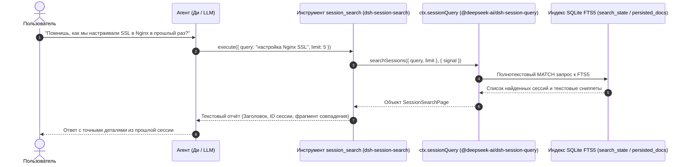

# 🔍 @goodandready-private/dsh-session-search

<div align="center">

<h3>Инструмент полнотекстового поиска по истории сессий для автономных агентов DeepSeek Harness</h3>

<p align="center">
  
  
  
  
  
</p>

<!-- Showcase Button -->
<p align="center">
  <a href="https://goodandready.app/"></a>
</p>

<p align="center">
  <a href="README.md"><b>🇬🇧 English</b></a> •
  <b>🇷🇺 Русский</b>
</p>

</div>

---

## Обзор

В штатной поставке **DeepSeek Harness** история прошлых диалогов индексируется полнотекстовым движком ядра (`@deepseek-ai/dsh-session-query-sqlite`), однако этот поиск доступен исключительно человеку через поисковую строку в боковой панели. Автономная модель (агент Ди / Dee) **не имеет инструмента** для самостоятельного обращения к архивам бесед.

Плагин `@goodandready-private/dsh-session-search` устраняет эту асимметрию: он регистрирует инструмент модели `session_search`, позволяя агенту самостоятельно вспоминать прошлые решения, извлечённые уроки, конфиги и контекст старых диалогов без необходимости вычитывать громоздкие архивы `.jsonl.zstd` в память.

---

## Архитектура и поток данных

Плагин полностью **host-only** (без клиентского бандла). Он не создаёт отдельную базу данных и не дублирует структуры поиска:



---

## Сравнение: Штатный DSH и плагин `dsh-session-search`

| Возможность | Штатный DSH Core | С плагином `dsh-session-search` |
|---|---|---|
| **Поиск сессий человеком в UI** | ✅ Доступен в сайдбаре | ✅ Сохранён без изменений |
| **Инструмент для агента (LLM tool)** | ❌ Отсутствует | ✅ Родной инструмент `session_search` |
| **Поисковый движок** | SQLite FTS5 (`ctx.sessionQuery`) | Напрямую использует штатный движок ядра |
| **Расход оперативной памяти** | Минимальный | Нулевой дополнительный оверхед (делегирование ядру) |
| **Формат сниппетов** | HTML-рендеринг в интерфейсе | Нормализованный текст для контекста LLM |
| **Индикация пагинации** | UI скролл / курсор | Подсказка модели: `(есть ещё результаты — уточни запрос)` |
| **Прерывание операции** | AbortSignal в API | Проброс через `execCtx.signal` |

---

## Установка

Пакет публикуется в приватный реестр GitHub Packages:

```bash
# Установка в профиль web
pnpm add @goodandready-private/dsh-session-search
```

Перезапустите DeepSeek Harness для применения бандл-патча (`cordis.patch.yml`).

---

## Конфигурация

Параметр `maxResults` настраивается в конфигурации профиля DSH:

```yaml
# конфигурация dsh
plugins:
  dsh-session-search:
    maxResults: 20
```

| Опция | Тип | По умолчанию | Описание |
|---|---|---|---|
| `maxResults` | `number` | `20` | Лимит возвращаемых совпадений по умолчанию. |

---

## Спецификация инструмента: `session_search`

### Параметры
* `query` (`string`, обязательный): Текст запроса (поисковые термы).
* `limit` (`integer`, опциональный): Максимум совпадений (автоматически зажимается в диапазон `1..100`, по умолчанию равен `maxResults`).

### Формат ответа
Инструмент формирует форматированный текстовый ответ:
```text
• Заголовок сессии [session-id-12345]
  Текстовый сниппет с найденным фрагментом сообщения...
• Вторая сессия [session-id-67890]
  Ещё один фрагмент обсуждения...
(есть ещё результаты — уточни запрос)
```

Если ничего не найдено:
```text
session_search: совпадений не найдено.
```

При внутренней ошибке движка:
```text
session_search: ошибка: <текст ошибки>
```

---

## Языковые решения и локализация (ADR-001)

Как зафиксировано в `docs/design/DESIGN.md`, кириллические строки инструмента `session_search` (описание тула, аргументов и служебных сообщений) сохранены на русском языке осознанно:
1. Инструмент спроектирован для русскоязычного агента Ди, чей основной рабочий контекст и системные промпты ведутся на русском языке.
2. Так как плагин является **host-only** (без пользовательского веб-интерфейса), клиентский реестр локализации `ctx.locale.register` не задействуется.
3. Пакет системной локализации `@goodandready/dsh-russian-lang` не модифицирует схемы серверных инструментов.

---

## Лицензия

MIT © 2026 GoodAndReady
