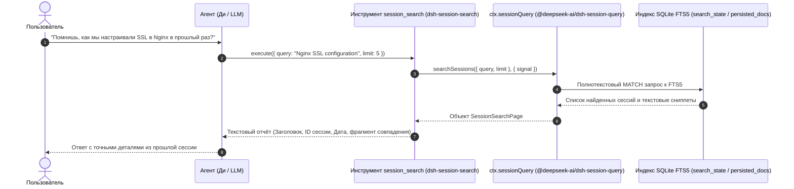

# 🔍 @goodandready/dsh-session-search

<div align="center">

<h3>Инструмент полнотекстового поиска по истории сессий для автономных агентов DeepSeek Harness</h3>

<p align="center">
  <a href="https://www.npmjs.com/package/@goodandready/dsh-session-search"></a>
  <a href="LICENSE"></a>
  <a href="https://github.com/topics/dsh-plugin"></a>
  <a href="https://nodejs.org"></a>
</p>

<!-- Showcase Button -->
<p align="center">
  <a href="https://goodandready.app/"></a>
</p>

<p align="center">
  <a href="README.md"><b>🇬🇧 English</b></a> •
  <a href="README.zh.md"><b>🇨🇳 中文说明</b></a> •
  <b>🇷🇺 Русский</b>
</p>

<!-- Project Support Table -->
<table align="center">
  <tr>
    <td align="center">
      ⭐ <strong>Если вам понравился этот плагин, пожалуйста, поставьте звезду на GitHub</strong> — это показывает, что проект полезен, и вдохновляет развивать его дальше.
      <br><br>
      🐛 <strong>Если вы нашли ошибку или хотите предложить улучшение</strong>, создайте issue на GitHub на любом удобном языке — полезные предложения обязательно попадут в новые версии.
    </td>
  </tr>
</table>

</div>

---

## Обзор

В штатной поставке **DeepSeek Harness** история прошлых диалогов индексируется полнотекстовым движком ядра (`@deepseek-ai/dsh-session-query-sqlite`), однако этот поиск доступен исключительно человеку через поисковую строку в боковой панели. Автономная модель (агент Ди / Dee) **не имеет инструмента** для самостоятельного обращения к архивам бесед.

Плагин `@goodandready/dsh-session-search` устраняет эту асимметрию: он регистрирует надёжный инструмент модели `session_search`, позволяя агенту самостоятельно вспоминать прошлые решения, извлечённые уроки, конфиги и контекст старых диалогов без необходимости вычитывать громоздкие архивы `.jsonl.zstd` в память.

---

## Архитектура и поток данных

Плагин полностью **host-only** (без клиентского бандла). Он не создаёт отдельную базу данных и не дублирует структуры поиска:



---

## Сравнение: Штатный DSH и плагин `dsh-session-search`

| Возможность | Штатный DSH Core | С плагином `dsh-session-search` |
|---|---|---|
| **Поиск сессий человеком в UI** | ✅ Доступен в сайдбаре | ✅ Сохранён без изменений |
| **Инструмент для агента (LLM tool)** | ❌ Отсутствует | ✅ Родной инструмент `session_search` |
| **Поисковый движок** | SQLite FTS5 (`ctx.sessionQuery`) | Напрямую использует штатный движок ядра |
| **Расход оперативной памяти** | Минимальный | Нулевой дополнительный оверхед (делегирование ядру) |
| **Формат сниппетов** | HTML-рендеринг в интерфейсе | Нормализованный текст для контекста LLM |
| **Временные метки** | Отображаются в UI | Компактная дата сессии: `(YYYY-MM-DD)` |
| **Индикация пагинации** | UI скролл / курсор | Подсказка модели: `(more results available — refine your query)` |
| **Защита выполнения** | Только ядро | Таймаут 30 секунд (`timeoutMs`), `isConcurrencySafe: true` |
| **Жизненный цикл** | Стандартный | Управляется через Cordis `ctx.effect` |
| **Прерывание операции** | AbortSignal в API | Проброс через `execCtx.signal` |

---

## Установка

Установка через CLI `dsh` для профиля web:

```bash
dsh plugin --profile web add @goodandready/dsh-session-search
```

Либо с помощью `pnpm`:

```bash
pnpm add @goodandready/dsh-session-search
```

Перезапустите профиль web DeepSeek Harness для применения бандл-патча (`cordis.patch.yml`).

---

## Конфигурация

Параметры настраиваются в конфигурации профиля DSH:

```yaml
# конфигурация dsh
plugins:
  dsh-session-search:
    maxResults: 20
    snippetLength: 200
    timeoutMs: 30000
```

| Опция | Тип | По умолчанию | Описание |
|---|---|---|---|
| `maxResults` | `number` | `20` | Лимит возвращаемых совпадений по умолчанию. |
| `snippetLength` | `number` | `200` | Максимальная длина сниппета вокруг совпадения (в символах). |
| `timeoutMs` | `number` | `30000` | Таймаут выполнения поиска в миллисекундах. |

Параметры также можно настраивать интерактивно в веб-интерфейсе DSH в разделе **Настройки → Плагины → Полнотекстовый поиск по сессиям**.

---

## Спецификация инструмента: `session_search`

### Параметры
* `query` (`string`, обязательный): Текст запроса (поисковые термы, не должен быть пустым).
* `limit` (`integer`, опциональный): Максимум совпадений (автоматически зажимается в диапазон `1..100`, по умолчанию равен `maxResults`).

### Формат ответа
Инструмент формирует форматированный текстовый ответ:
```text
• Заголовок сессии [session-id-12345] (2026-09-17)
  Текстовый сниппет с найденным фрагментом сообщения...
• Вторая сессия [session-id-67890] (2026-09-15)
  Ещё один фрагмент обсуждения...
(more results available — refine your query)
```

Если ничего не найдено:
```text
session_search: no matches found.
```

Если валидация аргументов не прошла:
```text
session_search: error: query must be a non-empty string.
```

При внутренней ошибке движка:
```text
session_search: error: <текст ошибки>
```

---

## Лицензия

MIT © 2026 GoodAndReady
