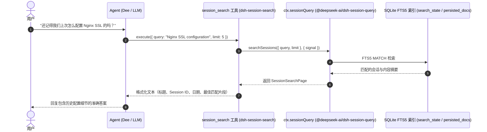

# 🔍 @goodandready/dsh-session-search

<div align="center">

<h3>面向 DeepSeek Harness Agent 的会话历史全文检索工具</h3>

<p align="center">
  <a href="https://www.npmjs.com/package/@goodandready/dsh-session-search"></a>
  <a href="LICENSE"></a>
  <a href="https://github.com/topics/dsh-plugin"></a>
  <a href="https://nodejs.org"></a>
</p>

<!-- Showcase Button -->
<p align="center">
  <a href="https://goodandready.app/"></a>
</p>

<p align="center">
  <a href="README.md"><b>🇬🇧 English</b></a> •
  <b>🇨🇳 中文说明</b> •
  <a href="README.ru.md"><b>🇷🇺 Русский</b></a>
</p>

<!-- Project Support Table -->
<table align="center">
  <tr>
    <td align="center">
      ⭐ <strong>如果您喜欢这个插件，请在 GitHub 上点个 Star</strong> — 这能让我知道该插件对您有所帮助，并激励我持续维护和开发。
      <br><br>
      🐛 <strong>如果您发现了 Bug 或有新功能建议</strong>，欢迎随时在 GitHub 提交 issue（支持任何语言）— 我会认真评估并在后续版本中实现。
    </td>
  </tr>
</table>

</div>

---

## 概述

在原生的 **DeepSeek Harness** 中，历史会话内容虽然由核心服务 (`@deepseek-ai/dsh-session-query-sqlite`) 建立了全文索引，但该功能仅暴露给人机界面（左侧边栏搜索框）。自主 Agent（Dee / 模型）**本身并没有被赋予检索历史会话的工具**。

`@goodandready/dsh-session-search` 解决了这一非对称性：它向模型注册了经过强化的原生 `session_search` 工具，使 Agent 能够直接检索过去的解决方案、经验教训、决策和上下文，而无需将庞大的 `.jsonl.zstd` 压缩日志解压到内存中。

---

## 架构与数据流

本插件为纯 **host-only** 架构，前端零额外开销。它直接复用核心 Cordis 检索服务：



---

## 对比：原生 DSH 与安装 `dsh-session-search`

| 能力 | 原生 DSH Core | 安装 `dsh-session-search` 后 |
|---|---|---|
| **人工在界面检索会话** | ✅ 边栏可用 (`WorkspaceBrowser`) | ✅ 保持原样（完全可用） |
| **Agent 自主检索工具** | ❌ 无（未注册工具） | ✅ 原生注册 `session_search` 工具 |
| **检索引擎** | SQLite FTS5 (`ctx.sessionQuery`) | 直接复用核心 SQLite FTS5 引擎 |
| **内存开销** | 低 | 零额外开销（代理给核心） |
| **匹配摘要格式** | 界面 HTML 渲染 | 规整为适合 LLM 上下文的纯文本 |
| **时间元数据** | 界面直观显示 | 紧凑会话日期：`(YYYY-MM-DD)` |
| **分页提示** | 界面滚动条 / Cursor | 模型提示：`(more results available — refine your query)` |
| **执行防卫** | 仅核心 | 30 秒执行超时 (`timeoutMs`)，`isConcurrencySafe: true` |
| **生命周期** | 标准 | 通过 Cordis `ctx.effect` 安全管理 |
| **取消操作支持** | API AbortSignal | 通过 `execCtx.signal` 透传 |

---

## 安装

通过 `dsh` CLI 为 web profile 安装：

```bash
dsh plugin --profile web add @goodandready/dsh-session-search
```

或者使用 `pnpm`：

```bash
pnpm add @goodandready/dsh-session-search
```

重启 DeepSeek Harness web profile 以加载 bundle patch (`cordis.patch.yml`)。

---

## 配置

在配置文件中配置相关选项：

```yaml
# dsh 配置
plugins:
  dsh-session-search:
    maxResults: 20
    snippetLength: 200
    timeoutMs: 30000
```

| 选项 | 类型 | 默认值 | 说明 |
|---|---|---|---|
| `maxResults` | `number` | `20` | 单次检索返回的最大结果数上限。 |
| `snippetLength` | `number` | `200` | 匹配词周围上下文摘要的最大字符长度。 |
| `timeoutMs` | `number` | `30000` | 检索执行超时时间（毫秒）。 |

---

## 工具规范：`session_search`

### 参数
* `query` (`string`, 必填): 检索词与关键字（必须为非空字符串）。
* `limit` (`integer`, 可选): 返回的最大匹配会话数（自动限制在 `1` 到 `100` 之间，默认值为 `maxResults`）。

### 输出格式
工具返回清晰的纯文本格式：
```text
• 会话标题 [session-id-12345] (2026-09-17)
  匹配关键字周围的上下文摘要片段...
• 第二个会话 [session-id-67890] (2026-09-15)
  历史对话中的另一段内容...
(more results available — refine your query)
```

若未检索到结果：
```text
session_search: no matches found.
```

若参数验证失败：
```text
session_search: error: query must be a non-empty string.
```

若底层执行异常：
```text
session_search: error: <错误信息>
```

---

## 许可证

MIT © 2026 GoodAndReady
